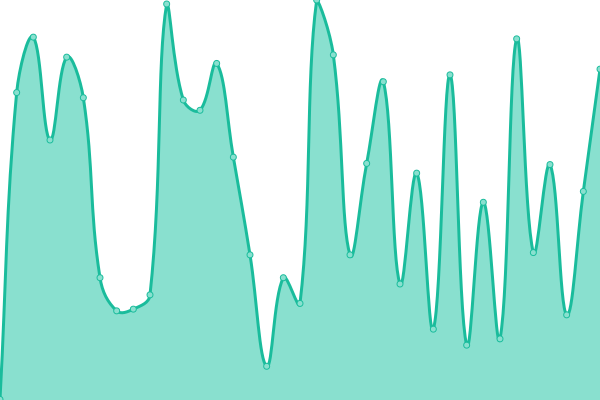
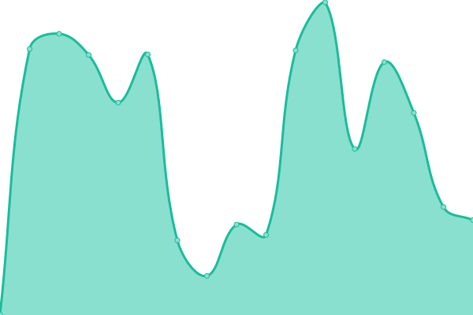
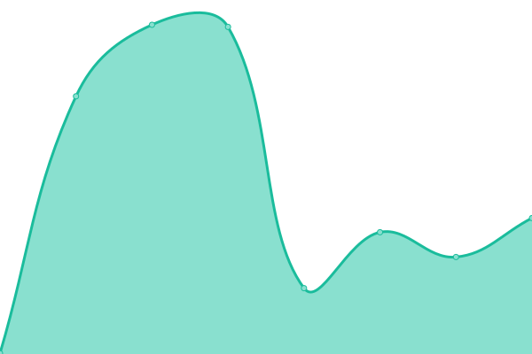

# [📈 Live Status](https://upptime.polido.pt): <!--live status--> **🟧 Partial outage**

This repository contains the open-source uptime monitor and status page for [polido.pt](https://polido.pt), powered by [Upptime](https://github.com/upptime/upptime).

With [Upptime](https://upptime.js.org), you can get your own unlimited and free uptime monitor and status page, powered entirely by a GitHub repository. We use [Issues](https://github.com/goncalopolido/upptime/issues) as incident reports, [Actions](https://github.com/goncalopolido/upptime/actions) as uptime monitors, and [Pages](https://upptime.polido.pt) for the status page.

<!--start: status pages-->
<!-- This summary is generated by Upptime (https://github.com/upptime/upptime) -->
<!-- Do not edit this manually, your changes will be overwritten -->
<!-- prettier-ignore -->
| URL | Status | History | Response Time | Uptime |
| --- | ------ | ------- | ------------- | ------ |
|  [Chibisafe](https://chibisafe.polido.pt) | 🟥 Down | [chibisafe.yml](https://github.com/goncalopolido/upptime/commits/HEAD/history/chibisafe.yml) | 

 522ms
     
 | 

<a href="https://upptime.polido.pt/history/chibisafe">97.35%</a>
    

|  [Uguu](https://uguu.polido.pt) | 🟩 Up | [uguu.yml](https://github.com/goncalopolido/upptime/commits/HEAD/history/uguu.yml) | 

 371ms
     
 | 

<a href="https://upptime.polido.pt/history/uguu">96.24%</a>
    

|  [clim8](https://clim8.polido.pt) | 🟩 Up | [clim8.yml](https://github.com/goncalopolido/upptime/commits/HEAD/history/clim8.yml) | 

 402ms
     
 | 

<a href="https://upptime.polido.pt/history/clim8">96.86%</a>
    

|  [Proxmox VE](https://proxmox.polido.pt) | 🟥 Down | [proxmox-ve.yml](https://github.com/goncalopolido/upptime/commits/HEAD/history/proxmox-ve.yml) | 

 346ms
     
 | 

<a href="https://upptime.polido.pt/history/proxmox-ve">95.96%</a>
    

<!--end: status pages-->

[**Visit our status website →**](https://upptime.polido.pt)

## 📄 License

- Powered by: [Upptime](https://github.com/upptime/upptime)
- Code: [MIT](./LICENSE) © [Anand Chowdhary](https://anandchowdhary.com), supported by [Pabio](https://pabio.com)
- Data in the `./history` directory: [Open Database License](https://opendatacommons.org/licenses/odbl/1-0/)
